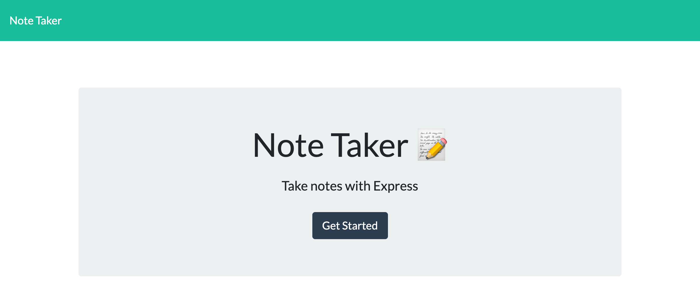
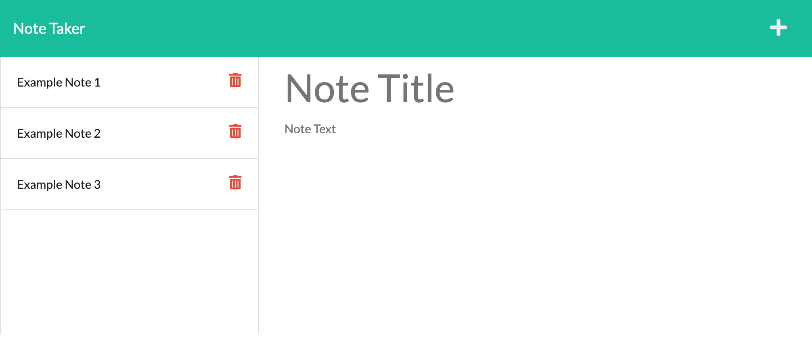

# noteTaker

## License 

## Description 

Note Taker is an application created using Express.js that can be used to write, save and delete notes. 

## Table of Contents 

[Installation](#Installation)

[Usage](#Usage)

[Contribution](#Contribution)

[License](#License)

[Tests](#Tests)

[Questions](#Questions)

## Installtion

To install this application you will clone the repository to your local machine. Installtion of express and uuid are required to run this application as well. 

## Usage 

Once at the the landing page you will click get started. From there you will be taken to the notes page where you can add and save notes. There is an option to delete a note if you wish, 

## Contribution 

There are no contributions to this application. 

## License 

MIT License 

## Tests

No test are required for this application. 

## Questions 

Elia Martinez 

Email: [eliahaydeemartinez@gmail.com](eliahaydeemartinez@gmail.com)

GitHub: [Here is the link to my github page](https://github.com/EliaMart/noteTaker)